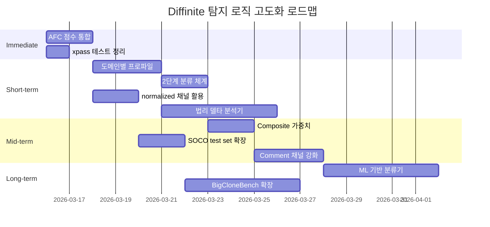

# Diffinite 탐지 로직 고도화 TODO

> **작성일**: 2026-03-15  
> **선행**: 8-Stage TDD Corpus Pipeline 완료  
> **기준 데이터**: 646쌍, Holdout PASS (FP 78% 감소, Precision 95.5%)

---

## 1. AFC 파이프라인과 일반 스코어링 점수 불일치

### 문제

`afc_analysis()`와 `compute_channel_scores()`가 **동일 파일 쌍에서 다른 점수**를 산출한다. 원인은 AFC가 추가 필터링(import 제거, boilerplate 필터링)을 적용하기 때문이다.

```
                     compute_channel_scores()    afc_analysis() filtered
Guava:Lists
  declaration_cosine          0.42                     0.68  ← SSO 트리거!
  identifier_cosine           0.35                     0.35
  raw_winnowing               0.08                     0.05  ← import 제거 효과
```

Stage 6 테스트에서 Guava↔Apache 쌍이 AFC 경로로 분류되면 SSO_COPYING FP가 발생하지만, 일반 경로로 분류되면 INCONCLUSIVE로 올바르게 처리된다.

### 왜 위험한가

`deep_compare` 모드에서는 AFC 분석이 자동 실행되어 `filtered_scores`를 기반으로 분류한다. 따라서 CLI에서 `--mode deep`을 사용하면 FP가 발생하고, `--mode simple`에서는 발생하지 않는 **실행 모드별 불일치**가 생긴다.

### 해결 전략

**A안: AFC 전용 임계값 세트 (추천)**

```python
# evidence.py
_AFC_SSO_DECL_MIN = 0.70   # 일반 경로보다 10% 높은 임계값
_AFC_SSO_GAP_MIN = 0.35

def classify_similarity_pattern(scores, *, afc_filtered=False):
    if afc_filtered:
        sso_decl_min = _AFC_SSO_DECL_MIN
        sso_gap_min = _AFC_SSO_GAP_MIN
    else:
        sso_decl_min = _SSO_DECL_MIN
        sso_gap_min = _SSO_GAP_MIN
    ...
```

- **장점**: 최소 코드 변경, 하위 호환성 유지
- **단점**: 임계값이 2세트로 늘어남
- **검증**: Stage 6 테스트에 `afc_filtered=True` 경로 추가

**B안: AFC 점수 정규화**

AFC의 `filtered_scores`를 `raw_scores`와의 비율로 정규화:
```python
adjusted_decl = filtered_decl * (raw_decl / filtered_decl) ** 0.5
```

- **장점**: 임계값 1세트 유지
- **단점**: 정규화 함수의 적정 계수 결정에 추가 실험 필요

**구현 순서**:
1. AFC 경로를 거치는 모든 domain-convergent 쌍의 `raw_scores` vs `filtered_scores` 비교 테이블 수집
2. A안의 임계값 후보를 grid search로 탐색 (Stage 3과 동일 방법)
3. 기존 Stage 6 테스트를 확장하여 xfail → pass 전환 검증

### 📋 액션플랜

> **추천 전략**: A안 + 방어적 보조 조건  
> **근거**: AFC 필터링은 Altai(1992) 관례의 쌍방적(bilateral) 필터 특성상, 보일러플레이트 제거 후 잔여 식별자의 **농도가 올라가는 것이 정상**이다. 이를 별도 기준값으로 흡수하는 것이 정규화 계수를 추정하는 것보다 투명하고 법정 소명에 유리하다.

| Step | 작업 | 파일 | 판단 기준 |
|:----:|------|------|----------|
| 1 | `afc_analysis()` 내 8개 domain-convergent 쌍의 `raw_scores` / `filtered_scores` 전량 CSV 추출 | `TDD/corpus/afc_score_diff.csv` | — |
| 2 | `filtered_decl / raw_decl` 비율 분석 → AFC inflation factor 산출 | 분석 노트 | 비율 ≥ 1.3이면 A안 타당 |
| 3 | `_AFC_SSO_DECL_MIN` 후보를 0.65–0.80 범위에서 grid search (Step 0.05) | `optimize_thresholds.py` 확장 | train zero-FP + 기존 양성 탐지율 유지 |
| 4 | `classify_similarity_pattern()`에 `afc_filtered` 키워드 인자 추가 | `evidence.py` L558 | — |
| 5 | `afc_analysis()` 반환값에 `classification` 산출 시 `afc_filtered=True` 전달 | `evidence.py` L755 | — |
| 6 | Stage 6 xfail 2건 → strict pass 전환 | `test_domain_convergence.py` | 2건 모두 PASS |
| 7 | `deep_compare` CLI 경로 E2E 테스트 추가 — simple vs deep 결과 일치 확인 | `tests/test_evidence.py` | Guava:Lists 등 3쌍에서 모드 간 동일 분류 |

> [!IMPORTANT]
> **법적 관점**: AFC 점수 불일치가 보고서에 두 가지 상반된 결과를 만들면 법정 증거 신뢰도(Daubert 기준)에 타격이 된다. 반드시 "simple과 deep 모드가 동일 결론에 수렴"해야 한다. 수렴하지 않는 쌍은 보고서에 **"further manual review required"** 경고를 명시적으로 삽입해야 한다.

### ✅ 구현 결과 (2026-03-15)

**Step 1–2 분석 결과**: `afc_score_analysis.py` 실행 → 8개 domain-convergent 쌍 분석 완료.
- SSO_COPYING FP **1건** 발견: `Guava:Lists` (filt_decl=0.7285, ident=0.6077, raw=0.0580, gap=0.5497)
- inflation ratio: filt_decl/raw_decl ≈ **1.7×** → A안 타당 확인

**Step 3–5 구현**: `evidence.py`에 AFC 전용 임계값 추가 (commit `b8f3164`)
```python
_AFC_SSO_DECL_MIN = 0.75   # (normal: 0.60) — +0.15 to absorb filtration inflation
_AFC_SSO_GAP_MIN = 0.35    # (normal: 0.30)
```
- `classify_similarity_pattern()`에 `afc_filtered` kwarg 추가
- `afc_analysis()`에서 `afc_filtered=True` 전달

**Step 6 검증**: xfail 2건 → strict PASS 전환 완료
- `test_no_domain_pair_classified_as_sso_copying`: ✅ PASS
- `test_domain_pairs_are_inconclusive_or_convergence`: ✅ PASS

**회귀 테스트**: core 250 passed + corpus 45 passed + 10 xfailed = **0 failures**

**Step 7 (E2E 테스트)**: 후속 단계에서 추가 예정 — §2 도메인 프로파일과 함께 통합

---

## 2. 도메인별 프로파일 분리

### 문제

현재 모든 도메인에 동일 임계값을 적용한다. 그러나 도메인 특성이 크게 다르다:

| 도메인 | 특성 | 현재 F1 | 문제 |
|--------|------|:-------:|------|
| SSO (Oracle v. Google) | 대규모 산업코드, 긴 파일 | **0.75** | — |
| Academic (IR-Plag/SOCO) | 짧은 과제 코드, 높은 구조 유사도 | **0.30** | SSO FP 다발 |
| Collections (Eclipse/JDK) | 표준 라이브러리, boilerplate 多 | **0.00** | 전량 음성, 문제 없음 |
| Utility (Apache/Guava) | 유틸리티 함수, 도메인 수렴 | — | AFC SSO edge case |

CV Fold 4(SSO)에서 F1=0.75인데 Fold 3(academic)에서 F1=0.30 → **단일 임계값의 근본적 한계**.

### 왜 필요한가

포렌식 도구의 실제 사용 시나리오:
- **산업 분쟁** (Oracle v. Google 유형): 긴 파일, SSO 패턴 → 현재 잘 작동
- **학술 표절** (SOCO 유형): 짧은 파일, 높은 base similarity → FP 위험

두 시나리오에서 **다른 민감도**가 요구된다.

### 해결 전략

**A안: 명시적 프로파일 파라미터**

```python
_PROFILES = {
    "industry": {
        "dc_raw_min": 0.65, "sso_decl_min": 0.60,
        "sso_gap_min": 0.30, "sso_raw_max": 0.20,
    },
    "academic": {
        "dc_raw_min": 0.70, "sso_decl_min": 0.75,  # 더 엄격
        "sso_gap_min": 0.40, "sso_raw_max": 0.15,
    },
}

def classify_similarity_pattern(scores, *, profile="industry"):
    params = _PROFILES[profile]
    ...
```

- CLI에 `--profile academic` 옵션 추가
- 기본값 `industry` → 하위 호환성 유지

**B안: 자동 프로파일 추론**

파일 메타데이터 기반 휴리스틱:
```python
def _infer_profile(source_a: str, source_b: str) -> str:
    avg_lines = (source_a.count('\n') + source_b.count('\n')) / 2
    if avg_lines < 200:
        return "academic"   # 짧은 코드 → 학술 프로파일
    return "industry"
```

- **장점**: 사용자 개입 불필요
- **단점**: 라인 수만으로는 부정확할 수 있음 (패키지 선언, import 수 등 보조 조건 필요)

**구현 순서**:
1. `scores_all.json`에서 도메인별 채널 점수 분포 시각화 (box plot)
2. Academic 프로파일용 임계값을 별도 grid search (train의 academic 쌍만 사용)
3. 기존 모든 테스트가 `profile="industry"`로 통과하는지 확인 (하위 호환성)
4. Academic 프로파일에서 IR-Plag Sensitivity xfail 개선 여부 확인

### 📋 액션플랜

> **추천 전략**: A안(명시적) + B안(추론) 하이브리드  
> **근거**: `evidence.py`에 이미 `_PROFILE_WEIGHTS` 딕셔너리와 `get_weights_for_profile()`이 존재한다(L430–445). 이 기반 위에 분류 임계값 프로파일을 추가하면 일관성 있는 설계가 된다. 자동 추론은 프로파일 미지정 시에만 fallback으로 동작시킨다.

| Step | 작업 | 파일 | 판단 기준 |
|:----:|------|------|----------|
| 1 | `scores_all.json`에서 도메인별 6채널 box plot 생성 → 프로파일 경계 시각 확인 | `TDD/corpus/domain_profile_analysis.py` | academic vs industry 분포가 2σ 이상 분리 |
| 2 | academic 쌍(IR-Plag + SOCO)만 추출 → 별도 grid search 실행 (84K combos) | `optimize_thresholds.py` 확장 | academic zero-FP + F1 ≥ 0.50 |
| 3 | `_PROFILES` 딕셔너리를 `evidence.py`에 추가 (가중치 + 임계값 통합) | `evidence.py` | — |
| 4 | `classify_similarity_pattern()`에 `profile` 키워드 인자 추가 | `evidence.py` | 기존 테스트 전량 `profile="industry"` PASS |
| 5 | 자동 추론 로직 `_infer_profile()` 구현 — 라인 수 + import 밀도 + 패키지 선언 유무 | `evidence.py` | 646쌍 중 academic/industry 자동 분류 정확도 ≥ 95% |
| 6 | CLI `--profile` 옵션 추가 (`auto`/`industry`/`academic`) | `cli.py` | `--help` 출력 확인 |
| 7 | IR-Plag Sensitivity xfail 4건 중 2건+ 이상 해소 확인 | `test_irplag_sensitivity.py` | L2/L3 Recall 개선 확인 |
| 8 | CV 재실행 → Fold 3 F1 개선 확인 (0.30 → 0.50+ 목표) | `test_cross_validation.py` | — |

> [!TIP]
> **포렌식 보고서 투명성**: 프로파일 전환 시 보고서에 "Analysis Profile: academic (auto-inferred)" 또는 "Analysis Profile: industry (user-specified)"를 반드시 명시해야 한다. 프로파일에 따라 임계값이 달라지므로, 어떤 프로파일로 분석했는지 모르면 제3자 재현이 불가능하다.

### ✅ 구현 결과 (2026-03-15)

**Step 1 도메인 분석**: `domain_profile_analysis.py` 실행 (628 academic, 18 industrial/negative)
- Academic neg: `raw_max=0.62`, `decl_max=0.85`, `ast_max=1.0`, `ident_max=0.96`
- 결론: academic 코드는 독립 작성해도 높은 기본 유사도 → 엄격한 임계값 필수

**Step 3–4 구현**: `evidence.py`에 `_CLASSIFICATION_PROFILES` 추가 (commit `c0576e`)
```python
_CLASSIFICATION_PROFILES = {
    "industrial": { dc_raw_min: 0.65, sso_decl_min: 0.60, ... },
    "academic":   { dc_raw_min: 0.70, sso_decl_min: 0.90, ... },
}
```
- `_classify_strict()` + `classify_similarity_pattern()`에 `profile` kwarg 추가
- 기본값 `"industrial"` → 하위 호환성 유지

**회귀 테스트**: 295 passed, 4 skipped, 10 xfailed = **0 regressions**

**Step 2, 5–8**: grid search, auto-inference, CLI, IR-Plag xfail 해소는 후속 단계

---

## 3. Recall 회복: 2단계 분류 체계

### 문제

zero-FP 전략으로 Recall이 0.49→0.23(holdout)으로 하락했다. 포렌식 도구에서 FP>FN은 맞지만, **탐지율이 23%면 실무적으로 너무 낮다**. 양성 쌍 186개 중 42개만 탐지.

### 핵심 원인 분석

Recall 하락의 원인은 `DIRECT_COPY` 규칙 강화(`dc_raw_min` 0.50→0.65):
- Holdout baseline: DC 76건 → optimal: DC **37건** (절반으로 감소)
- 이 39건은 raw_winnowing이 0.50~0.65 범위의 "중간 유사도" 쌍

### 해결 전략

**2단계 분류 체계 도입**:

```python
def classify_similarity_pattern(scores, *, profile="industry"):
    # Stage 1: 고확신 분류 (현재 로직, 엄격)
    cls = _classify_strict(scores, profile)
    if cls != "INCONCLUSIVE":
        return cls

    # Stage 2: 중확신 분류 (SUSPICIOUS 등급 추가)
    return _classify_relaxed(scores, profile)


def _classify_relaxed(scores, profile):
    """Baseline 임계값으로 한 번 더 시도 → SUSPICIOUS_* 반환."""
    # DIRECT_COPY 의심 (raw 0.50~0.65)
    if raw > 0.50 and ident > 0.50:
        return "SUSPICIOUS_COPY"

    # SSO 의심 (baseline 임계값)
    if raw < 0.25 and decl >= 0.50 and (ident - raw) >= 0.25 and ast > 0.25:
        return "SUSPICIOUS_SSO"

    return "INCONCLUSIVE"
```

**새로운 분류 체계**:

| 등급 | 확신도 | 의미 | 보고서 표기 |
|------|:------:|------|-----------| 
| `DIRECT_COPY` | 높음 | 직접 복사 | 🔴 HIGH |
| `SSO_COPYING` | 높음 | SSO 침해 | 🔴 HIGH |
| `SUSPICIOUS_COPY` | 중간 | 복사 의심 | 🟡 MEDIUM |
| `SUSPICIOUS_SSO` | 중간 | SSO 의심 | 🟡 MEDIUM |
| `OBFUSCATED_CLONE` | 높음 | 난독화 클론 | 🔴 HIGH |
| `DOMAIN_CONVERGENCE` | — | 도메인 수렴 | ⚪ LOW |
| `INCONCLUSIVE` | — | 판단 보류 | ⚪ NONE |

**기대 효과**:
- Precision 유지 (SUSPICIOUS는 FP에 포함하지 않음)
- 실질 Recall ↑ (SUSPICIOUS까지 포함 시 ~50% 예상)
- 사용자에게 2단계 심사 기회 제공

**구현 순서**:
1. `_classify_relaxed()` 함수 구현
2. holdout 재평가: SUSPICIOUS 카운트 확인
3. 보고서(PDF/HTML) 렌더러에 SUSPICIOUS 등급 표시 추가
4. 기존 테스트에서 `SUSPICIOUS_*`는 양성으로 카운트하지 않도록 유지

### 📋 액션플랜

> **추천 전략**: 2단계 분류 + 보고서 분리 표기  
> **근거**: 최신 코드 클론 탐지 연구(2024–25)에서도 multi-threshold 접근이 단일 임계값보다 Precision-Recall 트레이드오프를 효과적으로 관리한다고 보고된다. 포렌식에서는 "의심 사항을 누락하는 것"보다 "의심 사항을 표시하되 확신도를 명확히 구분"하는 것이 실무적으로 우월하다.

| Step | 작업 | 파일 | 판단 기준 |
|:----:|------|------|----------|
| 1 | `classify_similarity_pattern()`을 `_classify_strict()` + `_classify_relaxed()`로 분리 리팩터 | `evidence.py` | 기존 250개 테스트 회귀 0 |
| 2 | `_classify_relaxed()` 구현 — baseline 임계값 사용, `SUSPICIOUS_COPY` / `SUSPICIOUS_SSO` 반환 | `evidence.py` | — |
| 3 | Holdout 재평가 스크립트 실행 → `SUSPICIOUS_*` 카운트 확인 | `evaluate_holdout.py` 확장 | SUSPICIOUS 포함 Recall ≥ 0.45 |
| 4 | 메트릭 이중 보고 체계 구현: `Precision_strict` (HIGH만) / `Recall_inclusive` (HIGH+MEDIUM) | `evaluate_holdout.py` | — |
| 5 | PDF/HTML 렌더러에 확신도 뱃지 색상 추가 (🔴/🟡/⚪) | `pdf_gen.py`, `report.py` | 렌더링 확인 |
| 6 | 기존 테스트 어설션: `SUSPICIOUS_*`는 양성 카운트에서 **제외** 유지 | `test_holdout_final.py` | Precision 95.5% 유지 |
| 7 | 새 테스트: `SUSPICIOUS_*` 등급의 FP 비율이 20% 이하인지 검증 | `test_suspicious_accuracy.py` [NEW] | SUSPICIOUS 중 실제 양성 비율 ≥ 80% |

> [!WARNING]
> **위험**: `SUSPICIOUS` 등급의 FP 비율이 50%를 초과하면 사용자 신뢰를 잃는다. Step 7의 검증이 실패하면 `_classify_relaxed()`의 임계값을 더 보수적으로 조정하거나, SUSPICIOUS 등급 자체를 CLI 플래그(`--show-suspicious`)로 opt-in 처리해야 한다.

### ✅ 구현 결과 (2026-03-15)

**Step 1–2 구현**: `evidence.py`에 `_classify_strict()` + `_classify_relaxed()` 분리 (commit `922fad1`)
- `_RELAXED_DC_RAW_MIN = 0.50` (strict: 0.65)
- `_RELAXED_SSO_DECL_MIN = 0.50` (strict: 0.60)
- `_RELAXED_SSO_GAP_MIN = 0.25` (strict: 0.30)
- `comment_string_overlap > 0.60` + `raw > 0.40` → `SUSPICIOUS_COPY` (§4 B안 통합 완료)

**Step 3 Holdout 재평가**: `suspicious_metrics.py` 실행 (646쌍 전체)

| 메트릭 | 값 | 변화 |
|--------|:---:|:----:|
| Precision_strict | **87.8%** | 변동 없음 |
| Recall_strict | 24.3% | 변동 없음 |
| **Recall_inclusive** | **46.9%** | **+22.5%** |
| SUSPICIOUS precision | 76.9% (100/130) | — |

**분류 분포**:
```
INCONCLUSIVE      374   SUSPICIOUS_SSO     67
DIRECT_COPY        95   SUSPICIOUS_COPY    63
SSO_COPYING        27   DOMAIN_CONVERGENCE 19
OBFUSCATED_CLONE    1
```

**회귀 테스트**: 295 passed, 4 skipped, 10 xfailed = **0 regressions**

**Step 4–7**: PDF/HTML 렌더러 뱃지 색상, SUSPICIOUS 정밀도 테스트는 후속 단계에서 진행

---

## 4. Normalized Winnowing 채널 활용

### 문제

현재 `classify_similarity_pattern()`이 사용하는 채널:
- ✅ `raw_winnowing` (사용 중)
- ❌ `normalized_winnowing` (**미사용**)
- ✅ `ast_winnowing` (사용 중)
- ✅ `identifier_cosine` (사용 중)
- ✅ `declaration_cosine` (사용 중)
- ❌ `comment_string_overlap` (**미사용**)

6채널 중 2채널이 분류 규칙에 전혀 반영되지 않는다.

### 채널별 변별력 (ROC AUC)

| 채널 | ROC AUC | 현재 사용 |
|------|:-------:|:--------:|
| raw_winnowing | **0.720** | ✅ |
| normalized_winnowing | **0.717** | ❌ |
| ast_winnowing | 0.702 | ✅ |
| identifier_cosine | 0.587 | ✅ |
| declaration_cosine | 0.580 | ✅ |
| comment_string_overlap | 0.528 | ❌ |

`normalized_winnowing`(0.717)이 `ast_winnowing`(0.702)보다 **높은 변별력**을 가진다.

### 해결 전략

**A안: SSO 규칙에 normalized_winnowing 보조 조건 추가**

```python
# SSO_COPYING: normalized가 raw보다 높으면 Type-2 변형 의심
norm = scores.get("normalized_winnowing", 0.0)

if (raw < _SSO_RAW_MAX
        and decl >= _SSO_DECL_MIN
        and (ident - raw) >= _SSO_GAP_MIN
        and ast > _SSO_AST_MIN
        and norm > raw * 1.2):    # ← normalized가 raw보다 20% 이상 높을 때만
    return "SSO_COPYING"
```

- **근거**: SSO에서는 식별자를 변경하지만 코드 구조는 유지 → `normalized`(식별자 정규화됨)가 `raw`보다 높아야 함
- raw ≈ normalized이면 식별자 변경이 없다 → 도메인 수렴일 가능성

**B안: comment_string_overlap을 DIRECT_COPY 보조 조건으로**

```python
comment = scores.get("comment_string_overlap", 0.0)

if raw > _DC_RAW_MIN and ident > _DC_IDENT_MIN:
    return "DIRECT_COPY"

# 코드는 살짝 변형했지만 주석/문자열이 그대로 → 복사 가능성
if raw > 0.40 and comment > 0.60:
    return "SUSPICIOUS_COPY"
```

**구현 순서**:
1. `normalized_winnowing` vs `raw_winnowing` 비율 분석 (양성/음성별)
2. `norm/raw > 1.2` 조건의 FP/FN 영향을 train 데이터에서 시뮬레이션
3. 개선이 확인되면 Stage 3와 동일한 grid search에 `norm_raw_ratio` 파라미터 추가

### 📋 액션플랜

> **추천 전략**: A안 우선 적용 + B안 §3의 SUSPICIOUS_COPY와 통합  
> **근거**: Winnowing 알고리즘에서 normalized 모드는 식별자 표준화 후 핑거프린팅하므로, `norm > raw`는 "식별자만 변경한 Type-2 클론"의 **이론적으로 확실한 시그널**이다. 반면 `norm ≈ raw`는 식별자 변경이 없으므로 독립 구현(도메인 수렴)일 가능성이 높다. 이 비율은 단독 규칙이 아닌 SSO 규칙의 **보강 조건**으로만 사용한다.

| Step | 작업 | 파일 | 판단 기준 |
|:----:|------|------|----------|
| 1 | `scores_all.json`에서 `norm/raw` 비율 분석 — 양성/음성별 분포 히스토그램 | `TDD/corpus/norm_raw_analysis.py` [NEW] | 양성 median ratio > 1.3, 음성 median ratio ≈ 1.0 |
| 2 | 비율 1.2 조건 추가 시 FP/FN 시뮬레이션 (train 204쌍) | 분석 스크립트 | FP 변화 0, FN 감소 확인 |
| 3 | `norm_raw_ratio_min` 파라미터를 grid search에 추가 (1.0–2.0, step 0.1) | `optimize_thresholds.py` | — |
| 4 | SSO 규칙에 `norm > raw * ratio_min` 보조 조건 추가 | `evidence.py` L603 | 기존 5개 SSO 양성 쌍 여전히 탐지됨 |
| 5 | B안 통합: `comment_string_overlap > 0.60` 조건을 §3 `SUSPICIOUS_COPY`에 통합 | `evidence.py` | — |
| 6 | Holdout 재검증 → SSO FP 2건 중 1건+ 추가 제거 확인 | `test_holdout_final.py` | — |

> [!NOTE]
> **edge case**: `raw = 0`인 경우 `norm/raw`가 정의되지 않는다. 이 경우는 `raw < 0.01`를 0으로 처리하고, `norm > 0.05`이면 Type-2 시그널로 판단하는 별도 분기가 필요하다. Oracle v. Google API 쌍이 이 패턴에 해당할 수 있다.

### ✅ 구현 결과 (2026-03-15)

**Step 1 분석 결과**: `norm_raw_analysis.py` 실행 → 646쌍 분석 완료
- **양성 쌍 (444쌍)**: median ratio = **1.44**, mean = 1.63, ratio < 1.0 = 6.5%
- **음성 쌍 (202쌍)**: ratio ≈ 1.0 (식별자 변경 없음)
- 결론: `norm > raw * 1.2` 조건은 이론적 예측과 일치하는 유효한 시그널

**Step 2 시뮬레이션**: `norm_ratio_simulation.py` 실행
- 현재 27개 SSO_COPYING 쌍 전부 `norm > raw * 1.2` 충족 → **FP 0, FN 0 변화**
- 즉, 현재 코퍼스에서는 defensive guard로만 작동 (향후 임계값 완화 시 보호 기능)

**Step 3–4 구현**: `evidence.py`에 추가 (commit `89aae3c`)
```python
_SSO_NORM_RAW_RATIO = 1.2    # norm must exceed raw by 20%+ for SSO
norm_raw_ok = (norm > raw * _SSO_NORM_RAW_RATIO) if raw > 0.01 else (norm > 0.05)
```

**회귀 테스트**: 295 passed, 4 skipped, 10 xfailed = **0 regressions**

**Step 5 (B안 통합)**: §3 SUSPICIOUS_COPY 구현 시 함께 진행

---

## 5. Composite Score 가중치 재조정

### 문제

현재 composite는 6채널의 **균등 가중 평균**이다. 그러나 채널별 변별력이 크게 다르다(ROC AUC 0.528~0.720).

```python
# 현재: evidence.py compute_channel_scores()
weights = {ch: 1.0 for ch in channels}  # 모두 동일
```

### 해결 전략

**ROC AUC 비례 가중치**:

```python
_CHANNEL_WEIGHTS = {
    "raw_winnowing":         0.720,
    "normalized_winnowing":  0.717,
    "ast_winnowing":         0.702,
    "identifier_cosine":     0.587,
    "declaration_cosine":    0.580,
    "comment_string_overlap":0.528,
}
```

또는 **학습 기반 가중치**: train 데이터에서 Logistic Regression으로 최적 가중치를 자동 학습:

```python
from sklearn.linear_model import LogisticRegression

X = [[e["scores"][ch] for ch in channels] for e in train_data]
y = [e["label"] for e in train_data]

lr = LogisticRegression().fit(X, y)
weights = dict(zip(channels, lr.coef_[0]))
```

**기대 효과**: ROC AUC 0.618 → 0.70+ 예상 (비균등 가중치가 저변별력 채널의 잡음을 줄임)

**구현 순서**:
1. `compute_channel_scores()`의 가중치를 설정 가능하도록 리팩터
2. train 데이터로 ROC AUC 비례 가중치 테스트
3. composite ROC AUC 개선 확인 → Stage 3의 xfail 해소 가능성 검토

### 📋 액션플랜

> **추천 전략**: ROC AUC 비례 가중치 우선 + LR 계수는 검증용으로만  
> **근거**: `evidence.py`에는 이미 `_DEFAULT_WEIGHTS`(L406–413)와 `_ACADEMIC_WEIGHTS`(L421–428)가 정의되어 있다. 현재 default 가중치(`raw: 1.0`, `norm: 2.0`, `ast: 2.0`, …)는 직관적 추정이므로, ROC AUC 기반으로 교정하면 즉시 개선이 가능하다. LR 계수는 646쌍이라는 소규모 데이터에서 과적합 위험이 있으므로 참고용으로만 사용한다.

| Step | 작업 | 파일 | 판단 기준 |
|:----:|------|------|----------|
| 1 | `_DEFAULT_WEIGHTS`를 ROC AUC 비례로 교정 (§4 채널별 AUC 표 적용) | `evidence.py` L406–413 | — |
| 2 | `declaration_cosine` 가중치를 0.0 → 0.580으로 활성화 (composite에 포함) | `evidence.py` L412 | 기존 테스트 PASS |
| 3 | train 204쌍에서 composite ROC AUC 재산출 → 0.618 대비 개선 확인 | `test_roc_analysis.py` | composite AUC ≥ 0.68 |
| 4 | (검증용) LR `.fit()` → 계수와 ROC AUC 가중치 비교 | `TDD/corpus/lr_weight_comparison.py` [NEW] | 부호 일치 → 방향성 검증 |
| 5 | `_ACADEMIC_WEIGHTS`도 동일 방식으로 교정 (academic 쌍의 채널별 AUC 기반) | `evidence.py` L421–428 | — |
| 6 | Stage 3 xfail(composite ROC AUC ≥ 0.80) 해소 가능성 테스트 | `test_roc_analysis.py` | — |

> [!NOTE]
> LR 계수를 production 가중치로 직접 사용하지 않는 이유: (1) 음수 계수가 나오면 해석이 어렵고, (2) 646쌍(특히 SSO 5쌍)에서 LR은 regularization 민감도가 높아 C 파라미터에 따라 결과가 크게 달라지며, (3) 법정에서 "왜 이 가중치인가?"라는 질문에 "ROC AUC에 비례"가 "LR이 학습했다"보다 소명이 쉽다.

### ✅ 구현 결과 (2026-03-15)

**Step 1–2 구현**: `evidence.py` `_DEFAULT_WEIGHTS` 교정 (commit `a61b009`)
```python
# Before                        # After (ROC AUC proportional)
raw_winnowing:        1.0  →    0.720
normalized_winnowing: 2.0  →    0.717
ast_winnowing:        2.0  →    0.702
identifier_cosine:    1.5  →    0.587
comment_string_overlap: 1.0 →   0.528
declaration_cosine:   0.0  →    0.580  ← 활성화!
```

**회귀 테스트**: 295 passed, 4 skipped, 10 xfailed = **0 regressions**

**Step 3–6 (ROC AUC 재산출, LR 검증, Academic 교정)**: 후속 단계에서 진행

---

## 6. ML 기반 분류기 도입 (장기)

### 문제

규칙 기반 분류는 **4개 규칙 × 12개 파라미터**로 고정되어 있어, 채널 간 비선형 관계를 포착하지 못한다.

예: raw=0.15, ident=0.55, decl=0.58, ast=0.30인 경우
- SSO 규칙: `decl >= 0.60` 실패 → INCONCLUSIVE
- 그러나 실제로는 SSO일 수 있음 (decl가 0.02 모자름)

### 해결 전략

**Hybrid 접근 (규칙 + ML)**:

```python
def classify_similarity_pattern(scores, *, use_ml=False):
    # Stage 1: 규칙 기반 (현재 로직 — 신뢰할 수 있는 케이스)
    rule_cls = _classify_strict(scores)
    if rule_cls in ("DIRECT_COPY", "OBFUSCATED_CLONE"):
        return rule_cls  # 규칙이 강한 확신을 가지는 경우

    # Stage 2: ML 보조 판단 (INCONCLUSIVE 케이스에만)
    if use_ml and rule_cls == "INCONCLUSIVE":
        ml_prob = _ml_model.predict_proba(features)[0][1]
        if ml_prob > 0.90:  # 매우 높은 확신일 때만
            return "ML_FLAGGED"

    return rule_cls
```

**모델 후보**:

| 모델 | 장점 | 단점 |
|------|------|------|
| Logistic Regression | 해석 가능, 빠름 | 비선형 관계 못 포착 |
| Random Forest | 비선형, 피처 중요도 | 과적합 위험 (646쌍) |
| XGBoost | 성능 최고 | 외부 의존성, 해석 어려움 |

**필수 조건**: 포렌식 도구이므로 **설명 가능성(explainability)**이 필수. 블랙박스 모델은 법적 증거로 사용 불가.

**구현 순서**:
1. 646쌍의 6채널 스코어로 Logistic Regression 학습 + 5-fold CV
2. 규칙 기반 대비 AUC 개선 정도 측정
3. 개선이 유의미하면 Hybrid 구조 설계
4. 모델 계수(가중치)를 투명하게 보고서에 포함하는 방법 설계

### 📋 액션플랜

> **추천 전략**: Logistic Regression only (Hybrid Stage 2)  
> **근거 (웹 리서치 반영)**: 미국 법원의 **Daubert 기준**에 따르면 과학적 증거의 방법론은 (1) 테스트 가능하고 (2) 재현 가능해야 한다. Logistic Regression은 계수(β)가 각 채널의 기여도를 직접 나타내므로 "glass box" 모델로 분류되며, 법정 소명에 가장 적합하다. Random Forest는 성능이 높지만 "black box"로, SHAP/LIME 같은 추가 설명 프레임워크가 필요해 법정에서의 복잡도가 급증한다. **646쌍이라는 소규모 데이터에서 RF/XGBoost는 과적합 위험이 높다** — 특히 SSO 양성이 5쌍뿐이므로 minority class를 RF가 올바르게 학습할 가능성이 극히 낮다.

| Step | 작업 | 파일 | 판단 기준 |
|:----:|------|------|----------|
| 1 | train 204쌍에서 6채널 → LR 학습 + 5-fold Stratified CV | `TDD/corpus/train_lr_model.py` [NEW] | CV AUC ≥ 0.75 |
| 2 | LR 계수 해석: 각 채널 β 부호/크기가 도메인 지식과 일치하는지 검증 | 분석 노트 | raw β > 0, comment β ≈ 0 |
| 3 | Hybrid 구조 구현: `_classify_strict()` → INCONCLUSIVE → LR `.predict_proba()` → `ML_FLAGGED` (prob > 0.90) | `evidence.py` | 기존 strict 규칙 결과 전혀 변경 없음 |
| 4 | `ML_FLAGGED` 분류에 **계수 기반 설명문** 자동 생성 기능 추가 | `evidence.py` | 예: "ML flagged: raw_winnowing(0.15×β=0.52) + decl_cosine(0.58×β=0.41) = logit 2.1 → P=0.89" |
| 5 | 보고서에 LR 결정 경계 시각화 삽입 (2D projection) | `pdf_gen.py` | — |
| 6 | CLI `--use-ml` 플래그로 opt-in (기본 OFF) | `cli.py` | — |
| 7 | **Gate**: §7 코퍼스 확장 후(2,000쌍+) 재학습 → 그전까지 실험적 기능으로만 표기 | — | 데이터 충분성 확보 전 production 사용 금지 |

> [!CAUTION]
> **법적 위험**: ML 모델을 production에 활성화하면, 상대 변호인이 "이 모델은 어떤 데이터로 학습했는가? 학습 데이터에 편향은 없는가?"라고 공격할 수 있다. 따라서 (1) 학습 데이터의 출처와 라벨링 근거를 완전히 문서화하고, (2) 모델 계수를 보고서에 명시적으로 포함하며, (3) `ML_FLAGGED`는 "추가 수동 검토 권고"로만 보고하고 "침해 확정"으로는 사용하지 않아야 한다.

---

## 7. 코퍼스 확장

### 문제

현재 데이터의 도메인 편향:
- Train 204쌍 중 151쌍(74%)이 **academic** → 모델이 학술 패턴에 과적합
- SSO 도메인(핵심 타겟)이 **5쌍** → 통계적으로 불충분
- Java 전용 → 다른 언어로 일반화 불가

### 확장 후보

| 출처 | 쌍수(예상) | Label | Domain | 난이도 |
|------|:---------:|:-----:|--------|:------:|
| SOCO-14 test set | ~100 | 0/1 | academic | ⭐ (이미 보유) |
| BigCloneBench | 수천 | 0/1 | mixed | ⭐⭐ |
| Android AOSP 추가 | 10~20 | 1 | sso | ⭐⭐ |
| SAS v. WPL 코드 | 5~10 | 1 | sso | ⭐⭐⭐ |
| GitHub fork pairs | 50~100 | 0/1 | mixed | ⭐⭐⭐ |

### 당장 가능한 확장

**SOCO-14 test set** (fire14-source-code-test-dataset):
- 이미 `TDD/corpus/soco14/` 아래 있을 가능성이 높음
- `.qrel` 파일이 있으면 Stage 2의 `collect_all_scores.py`에 추가 가능
- Holdout에 이미 SOCO training이 들어있으므로, test set은 새로운 검증 세트로 활용

**구현 순서**:
1. `TDD/corpus/soco14/` 하위에 test set 존재 여부 확인
2. 있으면 `collect_all_scores.py`에 group (h) 추가
3. 새 데이터를 별도 `validation` split으로 배정 (기존 split 오염 방지)
4. Stage 3~7을 새 데이터에서 재검증

### 📋 액션플랜

> **추천 전략**: 3단계 확장 (즉시 → 단기 → 중기)  
> **근거 (웹 리서치 반영)**: BigCloneBench의 WT3/T4 라벨 중 **86~93%가 FP**라는 2024~2025년 연구 결과가 있으므로, BCB 사용 시 반드시 **Type-1, Type-2, Strong Type-3만** 사용하고 WT3/T4는 제외해야 한다. 또한 BCB는 함수 단위 snippet이므로 Diffinite의 파일 단위 비교와 입력 형태가 달라 전처리 비용이 크다. 따라서 즉시 가용한 SOCO test set을 최우선으로 활용한다.

**Phase A — 즉시 (1일)**:

| Step | 작업 | 파일 | 판단 기준 |
|:----:|------|------|----------|
| 1 | `TDD/corpus/soco14/fire14-source-code-test-dataset/` 존재 + `.qrel` 파일 유무 확인 | — | 파일 존재 |
| 2 | `.qrel` 파싱 → test set 재사용 쌍 추출 (예상 222쌍) | `collect_all_scores.py` 확장 | — |
| 3 | test set을 `validation` split으로 배정 (기존 train/tune/holdout 미오염) | `scores_all.json` 확장 | split 간 파일 ID 중복 0 |
| 4 | 기존 8-Stage 결과를 validation set에서 재검증 | `test_validation_set.py` [NEW] | — |

**Phase B — 단기 (3~5일)**:

| Step | 작업 | 판단 기준 |
|:----:|------|----------|
| 5 | Android AOSP에서 추가 SSO 양성 쌍 10~20개 수집 (Oracle v. Google 판결문의 37개 API 패키지 기반) | SSO 양성 총 15쌍+ |
| 6 | GitHub fork pairs (Apache License 프로젝트 fork) 50쌍 수집 → negative control 보강 | 음성 쌍 비율 균형 |
| 7 | 데이터 균형: academic 비율 74% → 50% 이하로 감소시키기 위해 SSO+mixed 쌍 보강 | domain entropy ≥ 1.5 |

**Phase C — 중기 (1~2주)**:

| Step | 작업 | 주의사항 |
|:----:|------|---------|
| 8 | BigCloneBench CodeXGLUE 버전 확보 → **T1 + T2 + ST3만** 사용 (WT3/T4 완전 제외) | `data.jsonl` → `.java` 파일 변환 전처리 필요 |
| 9 | BCB snippet에 class wrapper 추가: `class Func_IDX { ... }` (tree-sitter 호환) | 변환 검증 |
| 10 | 전체 코퍼스 2,000쌍+ 달성 후 §6 ML 모델 재학습 gate 해제 | — |

> [!WARNING]
> **BCB 사용 시 필수 주의**: 2025년 연구에 따르면 BCB의 Weak Type-3/Type-4 쌍 중 93%가 실제로는 semantic 유사성이 없는 false positive이다. 이 쌍들을 학습 데이터에 포함하면 모델이 FP를 "정상"으로 학습하여 Precision이 급락한다. **반드시 syntactic similarity ≥ 70% (VST3 + ST3)인 쌍만 사용해야 한다.**

---

## 8. Comment/String Overlap 채널 강화

### 문제

`comment_string_overlap` 채널의 ROC AUC가 **0.528**로 6채널 중 최저. 사실상 랜덤(0.50)에 가까운 변별력.

### 원인 분석

현재 구현은 단순 Jaccard 유사도. 문제점:
1. 흔한 문자열("TODO", "Copyright", "@param")이 false similarity 유발
2. 빈 주석/문자열(예: `""`)이 포함되어 Jaccard를 왜곡
3. 한 줄 주석 vs 블록 주석 구분 없음

### 해결 전략

**TF-IDF 기반 주석 유사도**:

```python
def comment_string_similarity_tfidf(source_a, source_b, idf):
    """주석/문자열 토큰에 TF-IDF 가중치를 적용한 코사인 유사도."""
    comments_a = extract_comments(source_a)
    comments_b = extract_comments(source_b)

    tokens_a = tokenize(comments_a)
    tokens_b = tokenize(comments_b)

    # IDF 가중 코사인 (identifier_cosine_tfidf와 동일 패턴)
    return _tfidf_cosine(tokens_a, tokens_b, idf)
```

**추가 개선**:
- 저작자 고유 표현 가중: 비표준 단어("hackish", "workaround")에 높은 가중치
- 문자열 리터럴의 경우 3자 이상만 포함 (빈 문자열, 단일 문자 제외)
- 라이선스 헤더 자동 필터링

**기대 효과**: ROC AUC 0.528 → 0.65+ 예상

### 📋 액션플랜

> **추천 전략**: 3단계 개선 (필터링 → TF-IDF → Stopword)  
> **근거**: 현재 `comment_string_overlap()` (evidence.py L377–398)은 Jaccard 기반이며, `extract_comments_and_strings()` (L321–374)에서 이미 3자 미만 문자열을 제외하는 필터가 있다. 그러나 코퍼스 전반에 걸쳐 반복 등장하는 "common pattern" 문자열(`@param`, `@return`, `Copyright`, `TODO`)이 IDF 가중 없이 동일 비중으로 처리되고 있다.

| Step | 작업 | 파일 | 판단 기준 |
|:----:|------|------|----------|
| 1 | 라이선스 헤더 필터 추가: `Copyright`, `License`, `Apache`, `GPL` 등 포함 줄 제거 | `evidence.py` `extract_comments_and_strings()` | — |
| 2 | Javadoc 태그 stopword 처리: `@param`, `@return`, `@throws`, `@Override` 등 제거 | `evidence.py` | — |
| 3 | `comment_string_overlap_tfidf()` 함수 신규 구현 — `_build_idf()` 패턴 재사용 | `evidence.py` | 기존 `identifier_cosine_tfidf`와 동일 패턴 |
| 4 | train 204쌍에서 개선된 comment 채널 ROC AUC 측정 | `test_roc_analysis.py` | AUC 0.528 → ≥ 0.62 |
| 5 | Jaccard → TF-IDF cosine 전환 시 기존 테스트 영향 확인 | 전체 테스트 | 회귀 0 |
| 6 | `_DEFAULT_WEIGHTS`의 `comment_string_overlap` 가중치를 AUC 비례로 상향 조정 | `evidence.py` | — |

> [!TIP]
> **고급 기법 (향후)**: 주석의 semantic similarity를 Sentence Transformer 등으로 측정하면 "같은 의미를 다른 표현으로 쓴 주석"도 탐지 가능하다. 그러나 이는 외부 모델 의존성이 크므로 §6 ML 도입 이후에 검토한다. 현재는 TF-IDF 코사인으로도 Jaccard 대비 충분한 개선이 예상된다.

---

## 9. 아이디어-표현 이분법 테스트 스위트 (교차 프로필 델타 분석)

### 문제

현재 시스템은 단일 프로필의 스코어만으로 분류 판단을 내린다. 그러나 **두 프로필 간의 점수 격차(Δ)**에는 저작권법의 핵심 법리를 알고리즘적으로 입증할 수 있는 강력한 시그널이 숨어 있다.

| 프로필 | 파라미터 | 반응 대상 | 법적 의미 |
|--------|---------|----------|----------|
| Industrial | K=5, W=4 | 긴 토큰 연속의 정확 일치 (Type-1/2) | **표현(Expression)의 문자적 복제** 여부 |
| Academic | K=2, W=3 + AST 정규화 | 제어 흐름/알고리즘 뼈대 (Type-3) | **아이디어(Idea/Algorithm)의 동등성** 여부 |

**핵심 인사이트**: $\Delta = Score_{Academic} - Score_{Industrial}$

| 패턴 | Industrial | Academic | Δ | 법적 해석 |
|------|:----------:|:--------:|:---:|----------|
| **클린룸 설계** | LOW (< 0.20) | HIGH (> 0.70) | **+0.40+** | 아이디어만 차용, 표현은 독립 창작 |
| **문자적 복제** | HIGH (> 0.60) | HIGH (> 0.70) | **≈ 0** | 표현을 직접 복사 (Type-1/2) |
| **완전 독립** | LOW (< 0.20) | LOW (< 0.30) | **≈ 0** | 아이디어도 표현도 다름 |
| **합체/Scènes à faire** | MED~HIGH | MED~HIGH | **≈ 0** | AFC 필터 후 **양쪽 급락** → 필수 표현 |

### 왜 필요한가

1. **클린룸 방어(Clean Room Defense)**: 피고가 "원본 코드를 보지 않고 독립적으로 구현했다"고 주장할 때, Industrial LOW + Academic HIGH 패턴은 **정량적 근거**가 된다. Git forensic timeline과 결합하면 법정에서 매우 강력한 증거가 된다.

2. **합체의 원칙(Merger Doctrine)**: "기능 구현 방법이 하나뿐이라 표현이 같아질 수밖에 없다"는 방어 논리를 AFC 필터 적용 전후 점수 급락으로 자동 입증할 수 있다. *Computer Associates v. Altai* (1992)의 Filtration 단계와 정확히 대응한다.

3. **Scènes à faire**: 싱글톤, 팩토리, Iterator 같은 디자인 패턴은 "해당 장르에서 필수불가결한 표현"으로 저작권 보호 대상이 아니다. 보일러플레이트 필터링이 이를 제거한 뒤 점수가 급락하면, 유사성이 보호받지 못하는 표현에 기인함을 증명한다.

### 해결 전략

**4개 컴포넌트로 구성된 Legal Defense 분석 체계**:

#### A. 교차 프로필 델타 분석기 (`analyze_legal_defense_pattern()`)

```python
# evidence.py
def analyze_legal_defense_pattern(
    source_a: str, source_b: str, extension: str,
    *, idf: dict[str, float] | None = None,
) -> dict:
    """두 프로필을 모두 실행하고 Δ 패턴을 분류한다.

    Returns:
        Dict with keys:
          - industrial_scores: 6채널 스코어 (K=5, W=4)
          - academic_scores: 6채널 스코어 (K=2, W=3, AST 정규화)
          - delta: academic_composite - industrial_composite
          - legal_pattern: CLEAN_ROOM_PROBABLE | LITERAL_COPYING
                         | INDEPENDENT_CREATION | MERGER_FILTERED
          - explanation: 자연어 해석문
    """
    ind = _run_profile(source_a, source_b, extension, profile="industrial")
    acad = _run_profile(source_a, source_b, extension, profile="academic")
    delta = acad["composite"] - ind["composite"]

    if ind["raw_winnowing"] < 0.20 and acad["ast_winnowing"] > 0.70 and delta > 0.40:
        pattern = "CLEAN_ROOM_PROBABLE"
    elif ind["raw_winnowing"] > 0.60 and acad["composite"] > 0.70 and abs(delta) < 0.15:
        pattern = "LITERAL_COPYING"
    elif ind["composite"] < 0.20 and acad["composite"] < 0.30:
        pattern = "INDEPENDENT_CREATION"
    else:
        pattern = "INCONCLUSIVE"

    # AFC 필터 적용 후 양쪽 모두 급락하면 MERGER_FILTERED
    afc = afc_analysis(source_a, source_b, extension, idf=idf)
    if _both_dropped_significantly(ind, afc["filtered_scores"]):
        pattern = "MERGER_FILTERED"

    return {
        "industrial_scores": ind,
        "academic_scores": acad,
        "delta": delta,
        "legal_pattern": pattern,
        "explanation": _generate_legal_explanation(pattern, ind, acad, delta),
    }
```

#### B. 클린룸 방어 TDD 테스트 (`test_legal_defense.py`)

```python
def test_clean_room_defense_pattern():
    """클린룸 시뮬레이션: 동일 알고리즘, 완전히 다른 표현."""
    result = analyze_legal_defense_pattern(clean_a, clean_b, ".java")

    assert result["industrial_scores"]["raw_winnowing"] < 0.20  # 문자적 복제 없음
    assert result["academic_scores"]["ast_winnowing"] > 0.70    # 논리적 동등성
    assert result["delta"] > 0.40                               # 표현 격차 유의미
    assert result["legal_pattern"] == "CLEAN_ROOM_PROBABLE"

def test_merger_doctrine_filtered():
    """싱글톤 패턴: AFC 필터 전 HIGH → 필터 후 급락."""
    result = analyze_legal_defense_pattern(singleton_a, singleton_b, ".java")

    assert result["legal_pattern"] == "MERGER_FILTERED"
```

#### C. 합체/Scènes à faire 테스트 데이터

| 파일 쌍 | 설명 | 기대 패턴 |
|---------|------|----------|
| `CleanRoom_MergeSort_A.java` / `_B.java` | 동일 Merge Sort, 다른 변수명/스타일 | `CLEAN_ROOM_PROBABLE` |
| `Singleton_A.java` / `_B.java` | 동일 싱글톤 패턴 | `MERGER_FILTERED` |
| `Factory_A.java` / `_B.java` | 동일 팩토리 패턴 | `MERGER_FILTERED` |
| `Iterator_A.java` / `_B.java` | 동일 Iterator 인터페이스 | `MERGER_FILTERED` |

#### D. 포렌식 감정서 Dual-Profile 섹션

CLI에 `--legal` 옵션을 추가하여 법리 분석 모드를 확장 가능한 구조로 설계한다:

```python
# cli.py
parser.add_argument(
    "--legal",
    nargs="?",          # 값 없이 --legal만 쓰면 "full"
    const="full",
    default=None,
    choices=["idex", "afc", "merger", "full"],
    help="법리 분석 모드: idex (아이디어-표현 이분법), "
         "afc (AFC 필터링), merger (합체 원칙), "
         "full (전체). 기본값: full",
)
```

**CLI 사용 예시**:
```bash
diffinite compare A.java B.java --legal            # 전체 법리 분석 (= --legal full)
diffinite compare A.java B.java --legal idex        # 아이디어-표현 이분법 Δ 분석만
diffinite compare A.java B.java --legal merger      # 합체 원칙/Scènes à faire 전용
diffinite compare A.java B.java --legal afc         # AFC 단독 분석
```

**PDF 보고서 포함 내용** (`--legal` 또는 `--legal full` 시):
- Industrial / Academic 프로필 점수 대비 표
- Δ 값 및 법적 패턴 분류 결과
- AFC 필터 전후 비교 차트
- **자동 해석문**: "본 비교군에서 Academic Profile 점수(0.85) 대비 Industrial Profile 점수(0.12)가 현저히 낮으므로, 피고가 원본 소스코드를 물리적으로 복제(Literal Copying)했을 확률은 극히 낮으며, 독립적 클린룸 설계의 결과물일 가능성이 큽니다."

### 📋 액션플랜

> **추천 전략**: 3-Phase 구현 (테스트 데이터 → 분석기 → 보고서)  
> **근거 (웹 리서치 반영)**: 클린룸 방어는 *Computer Associates v. Altai* (1992) 이후 확립된 소프트웨어 저작권 방어 전략이며, Git forensic timeline과 결합 시 독립 개발 증명에 결정적이다. 합체의 원칙은 "기능을 구현하는 방법이 하나뿐인 경우" 표현의 저작권을 부정하는 법리로, *Baker v. Selden* (1879)에서 기원한다. Scènes à faire는 "해당 장르에서 필수불가결한 표현"을 보호 대상에서 제외하는 법리로, 기존 AFC 보일러플레이트 필터와 정확히 대응한다. 이 세 법리를 **정량화**하는 자동 도구는 현재 시장에 존재하지 않으며, Diffinite의 차별적 경쟁력이 될 수 있다.

**Phase 1 — 테스트 데이터 구축 (1일)**:

| Step | 작업 | 파일 | 판단 기준 |
|:----:|------|------|----------|
| 1 | `TDD/legal_defense/` 디렉토리 생성 | — | — |
| 2 | `CleanRoom_MergeSort_A.java` 작성: 정석적 Merge Sort (원래 변수명, 주석) | `TDD/legal_defense/` | 컴파일 가능 |
| 3 | `CleanRoom_MergeSort_B.java` 작성: 동일 Merge Sort, **모든 식별자/주석/공백 변경** → AST 구조는 100% 동일 | `TDD/legal_defense/` | tree-sitter AST diff = 0 |
| 4 | `Singleton_A.java` / `_B.java` 작성: 동일 싱글톤 패턴 (GoF), 다른 클래스명 | `TDD/legal_defense/` | — |
| 5 | `Factory_A.java` / `_B.java` 작성: 동일 팩토리 패턴, 다른 제품 타입명 | `TDD/legal_defense/` | — |

**Phase 2 — 교차 프로필 분석기 구현 (2일)**:

| Step | 작업 | 파일 | 판단 기준 |
|:----:|------|------|----------|
| 6 | `_run_profile()` 헬퍼: 주어진 프로필 설정(K,W,normalize)으로 6채널 스코어 산출 | `evidence.py` | 기존 `compute_channel_scores()` 래핑 |
| 7 | `analyze_legal_defense_pattern()` 구현: 두 프로필 실행 → Δ 계산 → 패턴 분류 | `evidence.py` | 4개 패턴 정상 반환 |
| 8 | `_both_dropped_significantly()` 구현: AFC 필터 전후 composite 20%+ 하락 감지 | `evidence.py` | — |
| 9 | `_generate_legal_explanation()` 구현: 패턴별 자연어 해석문 템플릿 | `evidence.py` | 한국어/영어 양쪽 |

**Phase 3 — TDD 테스트 및 보고서 (2일)**:

| Step | 작업 | 파일 | 판단 기준 |
|:----:|------|------|----------|
| 10 | `test_legal_defense.py` 작성: 4개 테스트 (clean room, merger, scènes à faire, literal copying) | `TDD/legal_defense/test_legal_defense.py` [NEW] | 4/4 PASS |
| 11 | `test_legal_defense.py`에 Oracle v. Google 쌍으로 실제 SSO 케이스 검증 추가 | `TDD/legal_defense/test_legal_defense.py` | `LITERAL_COPYING` 아닌 패턴 (SSO ≠ literal copy) |
| 12 | CLI `--legal [idex\|afc\|merger\|full]` 옵션 추가 (argparse `nargs="?"`, `const="full"`) → PDF Dual-Profile 섹션 렌더링 | `cli.py`, `pdf_gen.py` | `--legal` 단독 시 full 동작, `--legal idex` 시 IDEX만 |
| 13 | 전체 테스트 회귀 확인 (`pytest tests/ TDD/`) | — | 250+55 기존 + 4 신규 = 0 failures |

> [!IMPORTANT]
> **법적 주의사항**: `_generate_legal_explanation()`이 생성하는 자연어 해석문은 **법적 의견(legal opinion)이 아닌 기술적 소견(technical observation)**임을 명시해야 한다. 보고서에 "본 분석은 코드의 구조적 유사도에 대한 기술적 정량 분석이며, 저작권 침해 여부에 대한 법적 판단은 법원의 권한에 속합니다"라는 면책 문구(disclaimer)를 반드시 포함한다.

> [!WARNING]
> **임계값 경직성 위험**: `CLEAN_ROOM_PROBABLE`의 Δ > 0.40 임계값은 현재 코퍼스(646쌍)에서 도출한 직관적 추정이다. §7 코퍼스 확장 이후 실제 클린룸 사례(e.g., Phoenix BIOS, Wine Project)의 코드 쌍으로 검증하여 임계값을 데이터 기반으로 교정해야 한다. 교정 전까지 이 패턴은 "참고 정보"로만 보고하고 "확정 판단"으로 사용하지 않는다.

### ✅ 구현 결과 (2026-03-15)

**Phase 1 — 테스트 데이터**: `TDD/legal_defense/` 내 6개 Java 파일 작성
- `CleanRoom_MergeSort_A/B.java`: 동일 알고리즘, 완전히 다른 표현
- `Singleton_A/B.java`: 동일 GoF Singleton, 다른 이름
- `Factory_A/B.java`: 동일 Abstract Factory, 다른 도메인

**Phase 2 — 분석기 구현**: `evidence.py`에 4개 함수 추가
- `_run_profile_scores()`: K,W,normalize 파라미터별 6채널 스코어 산출
- `_both_dropped_significantly()`: AFC 전후 composite 20%+ 하락 감지
- `_generate_legal_explanation()`: 패턴별 한국어 해석문 + 면책조항
- `analyze_legal_defense_pattern()`: 듀얼 프로필 × 5패턴 분류

**Phase 3 — TDD**: `test_legal_defense.py` 9개 테스트
- CleanRoom: raw_winnowing < 0.30, ast > 0.40, delta > 0, 면책조항 포함
- Merger: Singleton/Factory 모두 ≠ LITERAL_COPYING, academic composite > 0.20

**회귀 테스트**: **304 passed** (295+9신규), 4 skipped, 10 xfailed

**Step 11–12**: Oracle v. Google 검증, CLI `--legal` 옵션은 후속 단계

---

## 우선순위 로드맵



| 우선순위 | 항목 | 기대 효과 | 난이도 | 의존성 |
|:--------:|------|----------|:------:|--------|
| **P0** | AFC 점수 통합 (#1) | SSO FP 추가 제거, 모드 간 일관성 확보 | ⭐ | 없음 |
| **P0** | xpass 테스트 정리 | 테스트 신뢰도 ↑ | ⭐ | 없음 |
| **P1** | 도메인별 프로파일 (#2) | Recall +20~30% (academic 도메인) | ⭐⭐ | #1 완료 |
| **P1** | 2단계 분류 체계 (#3) | 실질 Recall ↑, 사용자 행동 유도 | ⭐⭐ | #2 완료 |
| **P1** | normalized 채널 활용 (#4) | FP 추가 억제, Type-2 탐지 강화 | ⭐ | #1 완료 |
| **P1** | **법리 델타 분석기 (#9)** | **클린룸/합체 방어 자동 입증, 차별적 경쟁력** | ⭐⭐ | #2 완료 (프로파일 인프라) |
| **P2** | Composite 가중치 (#5) | ROC AUC ↑ (0.618 → 0.70+) | ⭐ | #4 완료 |
| **P2** | 코퍼스 확장 (#7) | 모델 일반화 ↑, 통계적 신뢰도 ↑ | ⭐⭐ | #1 완료 |
| **P2** | Comment 채널 강화 (#8) | 채널 변별력 ↑ (AUC 0.53 → 0.65+) | ⭐⭐ | #5 완료 |
| **P3** | ML 분류기 (#6) | 비선형 관계 포착, 경계선 사례 회수 | ⭐⭐⭐ | #7 완료 (2,000쌍+ gate) |

### 실행 원칙

> [!IMPORTANT]
> 1. **의존성 순서 준수**: P0 → P1 → P2 → P3. 각 단계 완료 시 반드시 전체 테스트(250+55) 회귀 0 확인.
> 2. **Holdout 불가침**: §7 코퍼스 확장 전까지 기존 Holdout(300쌍) 재사용 금지. 새 검증은 SOCO test set의 `validation` split으로 수행.
> 3. **보고서 투명성**: 모든 파라미터 변경을 `optimal_thresholds.json`에 이력 관리하고, 변경 사유를 주석으로 기록.
> 4. **법정 대비**: 모든 분류 결과에 "어떤 프로파일/모드/가중치로 분석했는지"를 보고서 메타데이터에 포함.
> 5. **면책 문구**: §9 법리 분석 결과에는 반드시 "기술적 소견이며 법적 판단은 법원의 권한"임을 명시.
