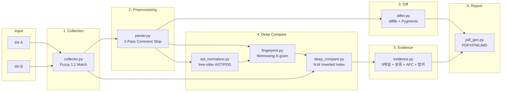

# Diffinite 아키텍처 개요

> **버전**: 0.3.0 (pyproject.toml) / 0.2.0 (__init__.py)  
> **라이선스**: Apache-2.0  
> **Python**: ≥ 3.10

## 시스템 목적

Diffinite는 **IP 소송, 코드 감사, 소프트웨어 표절 포렌식**을 위한 소스코드 비교 도구이다.
두 디렉토리의 소스코드를 비교하여 다중 증거 채널 분석 결과를 법정 제출용 PDF/HTML/Markdown 보고서로 생성한다.

---

## 파이프라인 흐름



---

## 실행 모드

| 모드 | 설명 | 주요 기능 |
|------|------|----------|
| `simple` | 1:1 파일 매칭 + diff | 빠른 비교, Winnowing 미사용 |
| `deep` (기본) | 1:1 + N:M 크로스매칭 | Winnowing, 다중 증거 채널, AFC 분석 |

## 파라미터 3-Tier 시스템

```
Tier 1: --profile (industrial / academic)  → K, W, T 프리셋
Tier 2: --k-gram, --window, --threshold-deep  → 수동 오버라이드
Tier 3: --grid-search  → K×W 감도 분석 스윕
```

---

## 모듈 의존성

```
cli.py ──→ pipeline.py ──→ collector.py
                      ├──→ parser.py ──→ languages/
                      ├──→ differ.py
                      ├──→ deep_compare.py ──→ fingerprint.py
                      │                   └──→ evidence.py
                      ├──→ evidence.py ──→ fingerprint.py
                      │               └──→ ast_normalizer.py ──→ languages/
                      └──→ pdf_gen.py
```

## 핵심 의존성

| 패키지 | 용도 |
|--------|------|
| `rapidfuzz` | 파일명 퍼지 매칭 |
| `charset-normalizer` | 인코딩 자동 감지 |
| `xhtml2pdf` | HTML → PDF 변환 |
| `pypdf` | PDF 병합, Bates 번호 |
| `pygments` | 구문 강조 |
| `reportlab` | PDF 렌더링 |
| `tree-sitter` (optional) | AST 분석 |
