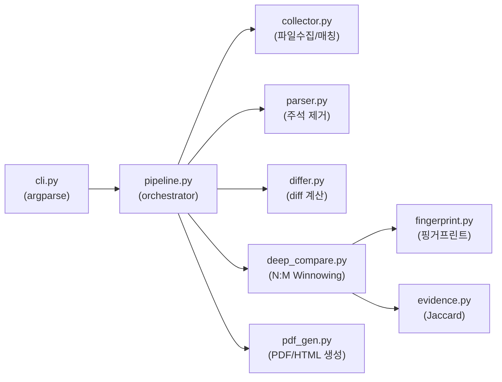

# Diffinite → VSCode Extension 이식 전략 분석

## 핵심 질문 3가지 (AGENTS.md 규칙)

기능 추가 전 확인:

1. **구체적으로 어떤 지표가 개선되는가?**
   - CLI는 `diffinite dir_a dir_b -o report.pdf` 실행 후 별도 뷰어에서 결과를 봐야 함
   - VSCode Extension이면 **에디터 안에서** side-by-side diff + cross-match 결과를 즉시 확인 가능
   - 사용자 워크플로가 "터미널 → PDF 뷰어"에서 "에디터 안 원클릭"으로 단축됨

2. **이것 없이는 왜 안 되는가?**
   - CLI만으로도 **기능상 문제는 없음**. 하지만 타겟 사용자(변호사)가 CLI에 익숙하지 않을 가능성이 높음
   - VSCode Extension은 "코드 감정인"이 쓰기에 더 자연스러운 인터페이스

3. **이것을 검증할 방법이 있는가?**
   - Extension을 VSIX로 빌드하여 실제 두 디렉토리를 비교하고, HTML WebviewPanel에서 결과가 정상 표시되는지 E2E 검증 가능

> [!IMPORTANT]
> 이 문서는 **이식 전략 분석**이지 구현 계획이 아닙니다. 실제 구현 착수 전 방향을 확정해야 합니다.

---

## 현재 아키텍처 분석



**이식에 유리한 점:**
- `pipeline.py`의 `run_pipeline()`이 CLI와 분리된 순수 함수 — 다른 프론트엔드에서 바로 호출 가능
- HTML 보고서 생성 기능(`_generate_html_report`)이 이미 존재 — WebviewPanel에 바로 표시 가능
- 모든 의존성이 Python (JS 포팅 필요 없이 subprocess로 호출 가능)

**이식에 어려운 점:**
- Python 런타임 의존 — 사용자 PC에 Python + diffinite 설치가 필수
- PDF 생성용 의존성(xhtml2pdf, reportlab)이 무거움

---

## 이식 전략: 두 가지 방식 비교

### 전략 A: Python subprocess 래퍼 (추천 — 실용적)

```
VSCode Extension (TypeScript)
    ↓ subprocess
Python CLI (기존 diffinite 그대로)
    ↓ --report-html 또는 --report-md
HTML/JSON 결과
    ↓
WebviewPanel에 표시
```

| 항목 | 내용 |
|------|------|
| **작업량** | Extension 코드 ~500줄 (TypeScript) |
| **코어 로직 변경** | 없음 |
| **전제조건** | 사용자의 Python 환경에 `diffinite` 설치됨 |
| **장점** | 기존 코드 100% 재사용, 유지보수 단일화 |
| **단점** | Python 의존성, subprocess 오버헤드 |

**Extension이 하는 일:**
1. Command Palette에서 "Diffinite: Compare Directories" 실행
2. 두 디렉토리를 `vscode.window.showOpenDialog`로 선택
3. 옵션 패널(mode, threshold 등)을 QuickPick/설정으로 제공
4. `diffinite dir_a dir_b --report-html /tmp/result.html` subprocess 실행
5. 결과 HTML을 `WebviewPanel`로 표시
6. (선택) `--report-md` 출력을 파싱하여 Summary TreeView 제공

### 전략 B: 순수 TypeScript 포팅 (장기적 — 대규모)

| 항목 | 내용 |
|------|------|
| **작업량** | 2000줄+ TypeScript, 전체 로직 재구현 |
| **코어 로직 변경** | 전체 재작성 |
| **전제조건** | 없음 (Node.js만 필요) |
| **장점** | Python 의존성 없음, 설치가 간단 |
| **단점** | 이중 유지보수, 포팅 검증 부담 막대 |

> [!CAUTION]
> 전략 B는 Winnowing, comment stripping FSM, diff 렌더링 등 **모든 핵심 로직**을 TypeScript로 재구현해야 합니다. 두 코드베이스의 결과 일관성을 보장하는 것만으로도 큰 부담입니다. 현 프로젝트 규모에서는 전략 A가 합리적입니다.

---

## 전략 A 실행 시 Extension 구조 (예상)

```
diffinite-vscode/
├── package.json          # Extension manifest
├── src/
│   ├── extension.ts      # activate/deactivate
│   ├── commands.ts       # "Compare Directories" 커맨드
│   ├── runner.ts         # subprocess로 diffinite CLI 호출
│   ├── webview.ts        # HTML 결과를 WebviewPanel에 표시
│   └── config.ts         # settings.json 연동 (Python 경로, 옵션 등)
├── media/
│   └── icon.png
└── tsconfig.json
```

**VSCode API 활용 포인트:**

| VSCode API | 용도 |
|------------|------|
| `vscode.commands.registerCommand` | "Diffinite: Compare" 커맨드 등록 |
| `vscode.window.showOpenDialog` | 디렉토리 A, B 선택 |
| `vscode.window.createWebviewPanel` | HTML 보고서 인라인 표시 |
| `vscode.window.withProgress` | 분석 진행률 표시 |
| `vscode.workspace.getConfiguration` | Python 경로, 기본 옵션 설정 |
| `child_process.spawn` | `diffinite` CLI 호출 |

---

## 방향 점검

> 지금까지 한 작업이 프로젝트의 핵심 목표에 부합하는가?

이 분석은 **"얼마나, 어디가 비슷한지" 보고하는 도구**를 **더 접근하기 쉬운 인터페이스**로 제공하는 전략을 검토한 것입니다. 핵심 로직(Winnowing, Jaccard, diff)은 변경하지 않으므로, 도구의 법정 설명 가능성에 영향을 주지 않습니다.
